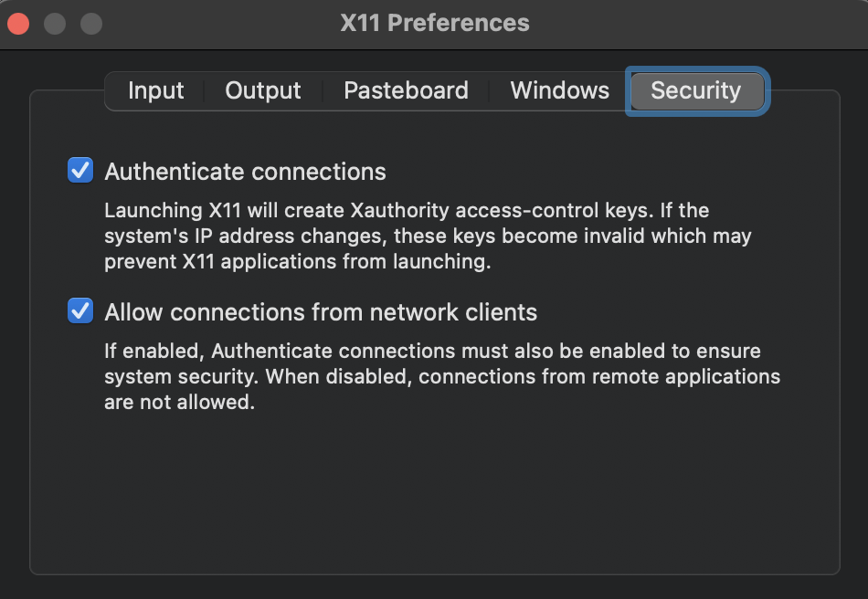

# dicex (Design of Integrated Circuits Examples)

Getting started with SPICE and verilog can be a daunting task. Companies that
make integrated circuits spend millions on Electronic Design Assistance (EDA)
tools, and even then, the truth is, they are not great. 

So, expecting open source EDA tools to be a polished, easy to use, easy to learn
tools is too much to ask.

Luckliy, at the beginning of the integrated circuit journey we don't need the
full blown comercial tools. At the beginning, we need to understand the
principles of SPICE, Verilog, how to write the files, how to run the
simulations, and how to view the results.

The difference between open source EDA tools and the commercial tools is that it's
easier to make complex systems with the commercial tools, and believe me, ICs are very complex.

For now though, let's focus on the transistors, resistor,  and the
building blocks for digital circuits, the digital gates.

# Tools
## Docker
Docker is something you must know about. It is a really good way to create small
virtual machines on any platform. [www.docker.com](https://docker.com)


## AIM-Spice
AIM-Spice is a free SPICE simulator developed by Trond Ytterdal at NTNU.
See more at [aimspice.com](http://aimspice.com)

## Icarus Verilog Simulator
Icarus Verilog is a Verilog simulation and synthesis tool. It operates as a
compiler, compiling source code written in Verilog (IEEE-1364) into some target
format. For batch simulation, the compiler can generate an intermediate form
called vvp assembly. This intermediate form is executed by the ``vvp'' command.
For synthesis, the compiler generates netlists in the desired format.

See more at [iverilog.icarus.com](http://iverilog.icarus.com)
and
[iverilog.fandom.com/wiki](https://iverilog.fandom.com/wiki/)

## GTKWave
GTKWave is a fully featured GTK+ based wave viewer for Unix, Win32, and Mac OSX
which reads LXT, LXT2, VZT, FST, and GHW files as well as standard Verilog
VCD/EVCD files and allows their viewing. Documentation in pdf format can be
found [gtkwave.sourceforge.net/gtkwave.pdf](http://gtkwave.sourceforge.net/gtkwave.pdf).

See [gtkwave.sourceforge.net](http://gtkwave.sourceforge.net) for details


# Getting started

Install docker from [docker.com](http://docker.com)

Clone this repository

``` sh
git clone https://github.com/wulffern/dicex
```
  
## Mac
Open a terminal, navigate to dicex, and run

``` sh
xterm &
```

Which should start XQuartz. Go to XQuartz - Preferences - Security, and select
"Allow connections from network clients".



Then start ciceda

``` sh
xhost + localhost
./ciceda_mac.sh
```

Which runs the command 

``` sh
docker run --rm -it -p 5900:5900 -v `pwd`:/home/ciceda/dicex -i wulffern/ciceda:centos_latest bash -l
```

Now you can run aimspice, iverilog, gtkwave, etc

## Windows

Open powershell, navigate to dicex.

Start ciceda with

``` sh
./ciceda_windows.sh
```

Download a VNC server

## Linux
Should be the same as mac.

# Examples
## SPICE

The folders called ex1 etc are related to the course TFE4152 Design of
integrated circuits 

There are a few examples in spice/, for example 
``` sh
cd ~/dicex/spice/NCHIO
make
```
## Verilog
Examples for verilog are in ~/eda/verilog, for example
``` sh
cd ~/dicex/verilog/
```
 
Start waveform viewer
``` sh
gtkwave &
```

Run simulation
``` sh
make
```

  
  
In GTKWave, File -> Open New Tab. Find counter/test.vcd


# Support
I would try carsten@ntnu.no, however, I get about 100 emails per day, so my
response rate is not great. 


